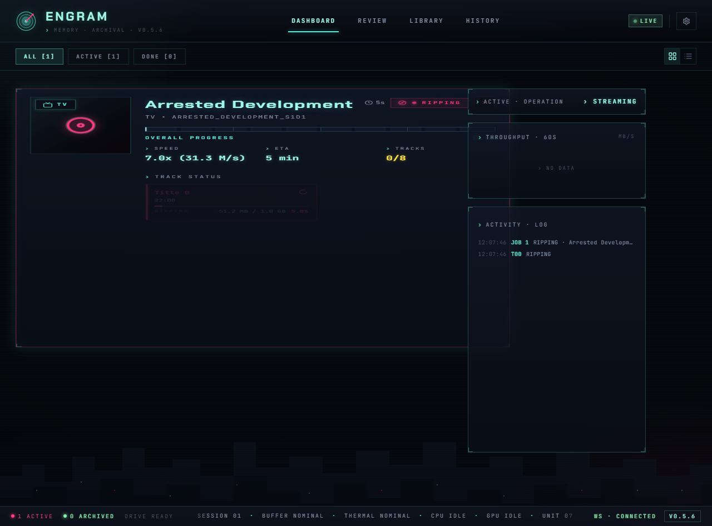
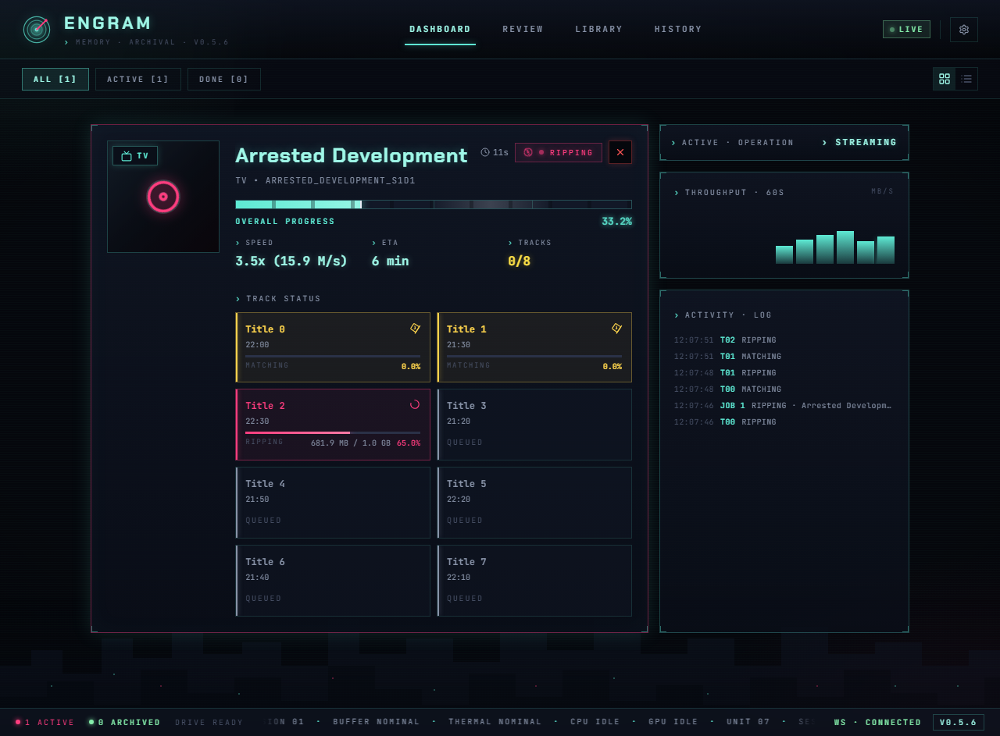
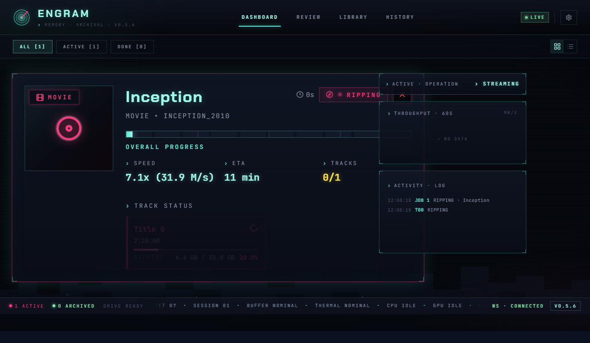
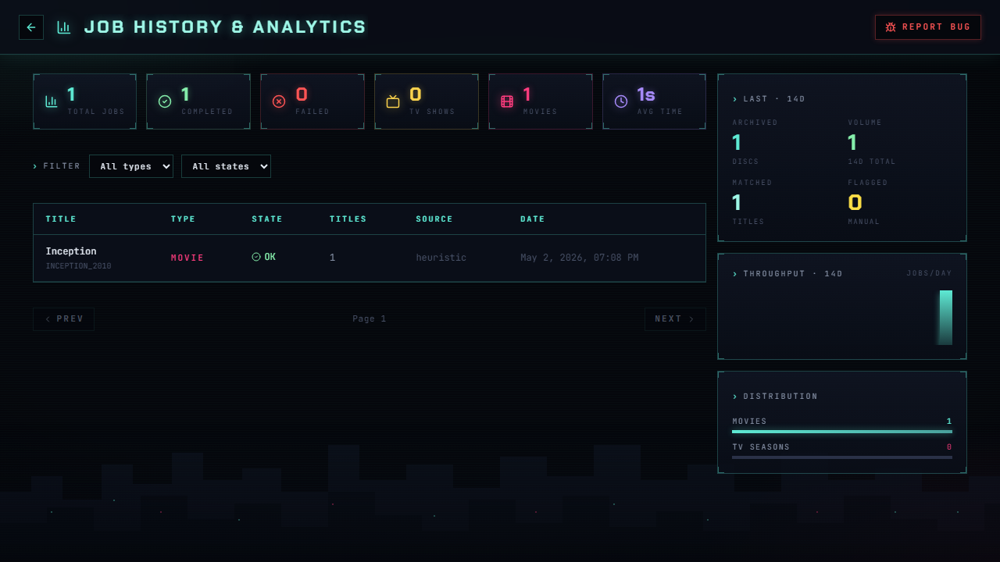
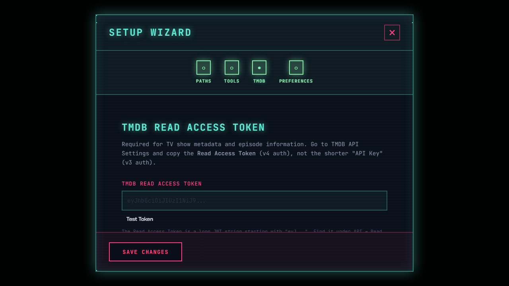

<p align="center">
  
</p>

<h1 align="center">Engram</h1>

<p align="center">
  Disc ripping and media organization with a reactive web dashboard.
  <br />
  Monitors optical drives, rips with MakeMKV, identifies episodes via audio fingerprinting,
  <br />
  and files everything into your media library — automatically.
</p>

<p align="center">
  <a href="https://github.com/Jsakkos/engram/releases"></a>
  <a href="https://github.com/Jsakkos/engram/actions/workflows/ci.yml"></a>
  <a href="LICENSE"></a>
</p>

---

## Screenshots

<table>
  <tr>
    <td><br /><sub>Ripping a TV disc with real-time progress</sub></td>
    <td><br /><sub>Track grid showing per-episode byte progress</sub></td>
  </tr>
  <tr>
    <td><br /><sub>Audio fingerprint matching with confidence scores</sub></td>
    <td><br /><sub>Completed job with activity log</sub></td>
  </tr>
  <tr>
    <td><br /><sub>Movie disc detection with MOVIE badge</sub></td>
    <td><br /><sub>Job history with stats dashboard and drill-down</sub></td>
  </tr>
  <tr>
    <td><br /><sub>Human-in-the-loop episode review queue</sub></td>
    <td><br /><sub>Setup wizard — TMDB &amp; OpenSubtitles configuration</sub></td>
  </tr>
</table>

## Features

- **Automatic disc detection** — monitors optical drives and starts processing on insertion
- **Smart classification** — distinguishes TV shows from movies using duration analysis, TMDB lookup, and TheDiscDB; uses MakeMKV disc name as a TMDB fallback for merged-word volume labels (e.g. `STRANGENEWWORLDS_SEASON3`)
- **Audio fingerprint matching** — identifies TV episodes via ASR transcription matched against subtitles
- **Subtitle downloads** — fetches subtitles via OpenSubtitles.com REST API (preferred, free tier available) with Addic7ed as fallback
- **Real-time dashboard** — cyberpunk-themed web UI with WebSocket live updates, progress tracking, and notifications
- **Human-in-the-loop** — review queue for low-confidence matches, unreadable disc labels, and ambiguous content with pre-filled correction modal
- **Job history & analytics** — searchable archive of all completed/failed jobs with drill-down detail panel, processing timeline, and TheDiscDB metadata
- **TheDiscDB integration** — automatic disc identification via content hash fingerprinting with persisted title mappings
- **Responsive design** — works on desktop and mobile with compact/expanded view modes

## Platform Support

| Feature | Windows | Linux | macOS |
|---------|---------|-------|-------|
| Automatic drive detection | Yes | Yes | No |
| Staging folder auto-import | Yes | Yes | Yes |
| MakeMKV ripping | Yes | Yes | Yes |
| Episode matching (ASR) | Yes | Yes | Yes |
| Web dashboard & API | Yes | Yes | Yes |
| Tool auto-detection | Yes | Yes | Yes |
| TheDiscDB / TMDB lookup | Yes | Yes | Yes |

**Windows** has full automatic disc detection via kernel32 APIs. **Linux** has native optical drive detection via `/sys/block` and `blkid`. On **macOS**, the backend and dashboard run fully, but disc insertion must be triggered via the staging import API.

On all platforms, Engram supports a **staging folder workflow**: drop a folder of pre-ripped MKV files into the staging directory and Engram will auto-detect, classify, match, and organize them. This is the primary workflow on systems without optical drives.

## Prerequisites

- [MakeMKV](https://www.makemkv.com/) with a valid license
- TMDB API Read Access Token (v4) from [TMDB](https://www.themoviedb.org/settings/api)
- If running from source: Python 3.11+ and [uv](https://docs.astral.sh/uv/), Node.js 18+

## Install

### Option A: Standalone executable (Windows)

Download `engram-windows-x64.zip` from the [Releases](https://github.com/Jsakkos/engram/releases) page, extract it, and run `engram.exe`. No Python or Node.js required.

### Option B: From source (all platforms)

```bash
git clone https://github.com/Jsakkos/engram.git
cd engram

# Backend
cd backend
uv sync
cd ..

# Frontend
cd frontend
npm install
cd ..
```

For GPU-accelerated transcription (optional):

```bash
cd backend
uv sync --extra gpu
```

### Start the dev servers

Backend:

```bash
cd backend
uv run uvicorn app.main:app --reload
```

Frontend (separate terminal):

```bash
cd frontend
npm run dev
```

Open http://localhost:5173 in your browser.

## Configuration

On first launch the Config Wizard walks you through setup: MakeMKV path, library paths, TMDB token, and more. Settings are stored in the database and editable from the Settings page.

**TMDB**: The wizard asks for a **Read Access Token** (v4 auth) from your [TMDB API Settings](https://www.themoviedb.org/settings/api). This is the long JWT string starting with `eyJ...`, not the shorter v3 API Key.

**OpenSubtitles** (optional): For more reliable subtitle downloads, configure an [OpenSubtitles.com](https://www.opensubtitles.com) account. Free tier allows 5 downloads/day; consumer API keys at [opensubtitles.com/consumers](https://www.opensubtitles.com/en/consumers). Without credentials, Engram falls back to scraping Addic7ed.

An optional `backend/.env` file can override server-level defaults:

| Variable | Description | Default |
|----------|-------------|---------|
| `DATABASE_URL` | SQLite connection string | `sqlite+aiosqlite:///./engram.db` |
| `HOST` | Server bind address | `127.0.0.1` |
| `PORT` | Server port | `8000` |
| `DEBUG` | Enable simulation endpoints | `false` |

## Architecture

Hub-and-spoke design. The Job Manager orchestrates five modules through a state machine (`IDLE -> IDENTIFYING -> RIPPING -> MATCHING -> ORGANIZING -> COMPLETED`).

```
                        React Dashboard
          (Dashboard, Review Queue, History, Config Wizard)
                             |
                          WebSocket
                             |
                        FastAPI Backend
                             |
                        Job Manager
                             |
        +----------+---------+-----------+-----------+
        |          |         |           |           |
    Sentinel   Analyst   Extractor   Curator    Organizer
     (drive    (TV vs    (MakeMKV    (episode   (file
     monitor)  movie)    wrapper)    matching)  organization)
```

### Frontend

React 18 + TypeScript + Vite SPA with a cyberpunk dual-tone (cyan/magenta) theme on a deep navy background with circuit board traces.

- **Dashboard** — filterable job cards (Active/Done/All) with expanded and compact view modes, real-time progress, speed/ETA, cover art with holographic effects, and browser notifications
- **Review Queue** — human-in-the-loop UI for resolving ambiguous episode matches and movie edition selection
- **History** — all completed/failed jobs with drill-down detail panel showing error messages, processing timeline, classification info, TheDiscDB metadata, and per-track breakdown. Deep-linkable via `/history/:jobId`
- **Config Wizard** — first-run setup and settings modal for library paths, API keys, and preferences

Key libraries: React Router v7, Framer Motion, Tailwind CSS v4 (with `@theme inline`), Lucide React, Sonner.

## Development

```bash
# Lint and format
cd backend
uv run ruff check .
uv run ruff format .

# Backend tests
uv run pytest

# Frontend E2E tests (requires backend running with DEBUG=true)
cd frontend
npx playwright install   # first time only
npm run test:e2e
npm run test:e2e:ui      # with interactive UI
```

### Linux / macOS Usage

On Linux, Engram detects optical drives automatically via `/sys/block`. If you don't have an optical drive, use the **staging folder workflow**:

1. Rip your discs with MakeMKV directly
2. Place the output MKV files in a subdirectory under the staging path (default: `~/engram/staging/`):
   ```
   ~/engram/staging/MY_SHOW_S1D1/
     title_t00.mkv
     title_t01.mkv
     title_t02.mkv
   ```
3. The staging watcher automatically detects the new folder and creates a job (enabled by default on Linux/macOS)
4. Engram classifies, matches episodes, and organizes files into your library

You can also trigger import manually via the API:

```bash
curl -X POST localhost:8000/api/staging/import \
  -H "Content-Type: application/json" \
  -d '{"staging_path":"/home/you/engram/staging/MY_SHOW_S1D1","volume_label":"MY_SHOW_S1D1","content_type":"tv","detected_title":"My Show","detected_season":1}'
```

The staging watcher can be toggled in Settings (`staging_watch_enabled`).

### Simulation

With `DEBUG=true`, you can test the full workflow without a physical disc:

```bash
# TV disc
curl -X POST localhost:8000/api/simulate/insert-disc \
  -H "Content-Type: application/json" \
  -d '{"volume_label":"ARRESTED_DEVELOPMENT_S1D1","content_type":"tv","simulate_ripping":true}'

# Movie disc
curl -X POST localhost:8000/api/simulate/insert-disc \
  -H "Content-Type: application/json" \
  -d '{"volume_label":"INCEPTION_2010","content_type":"movie","simulate_ripping":true}'
```

## Project Structure

```
engram/
  backend/
    app/
      api/            # REST + WebSocket endpoints
      core/           # Sentinel, Analyst, Extractor, Curator, Organizer,
                      #   DiscDB Classifier, TMDB Classifier
      matcher/        # Episode identification (ASR + subtitle matching)
      models/         # SQLModel database models (DiscJob, DiscTitle, AppConfig)
      services/       # Job Manager, State Machine, Ripping Coordinator,
                      #   Event Broadcaster, Config Service
      config.py       # Server-level settings (host, port, debug)
      database.py     # Async SQLite setup + schema migration
      main.py         # FastAPI entry point with lifespan management
    pyproject.toml
  frontend/
    src/
      app/
        components/   # DiscCard, TrackGrid, StateIndicator, ProgressBar,
                      #   MatchingVisualizer
        hooks/        # useJobManagement, useDiscFilters, useElapsedTime,
                      #   useNotifications
      components/     # HistoryPage, ReviewQueue, ConfigWizard, NamePromptModal
      hooks/          # useWebSocket
      styles/         # Tailwind theme (navy palette, glow tokens, circuit board)
      types/          # TypeScript definitions + adapters
    e2e/              # Playwright E2E tests (10 spec files)
    vite.config.ts
  docs/
    screenshots/      # UI workflow screenshots
  README.md
  CLAUDE.md
  TESTING.md
```

## License

AGPL-3.0. See [LICENSE](LICENSE).

## Acknowledgments

- [MakeMKV](https://www.makemkv.com/) for disc decryption
- [mkv-episode-matcher](https://github.com/Jsakkos/mkv-episode-matcher) for audio fingerprinting
- [TheDiscDB](https://thediscdb.com/) for disc content hash lookups
- [TMDB](https://www.themoviedb.org/) for media metadata and poster art
