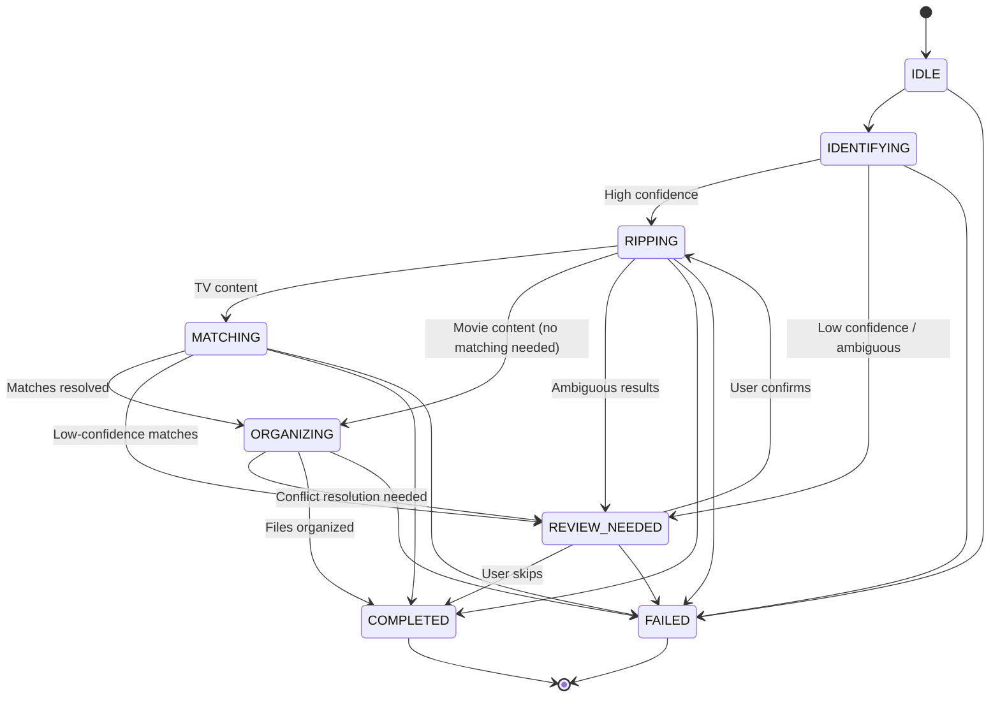
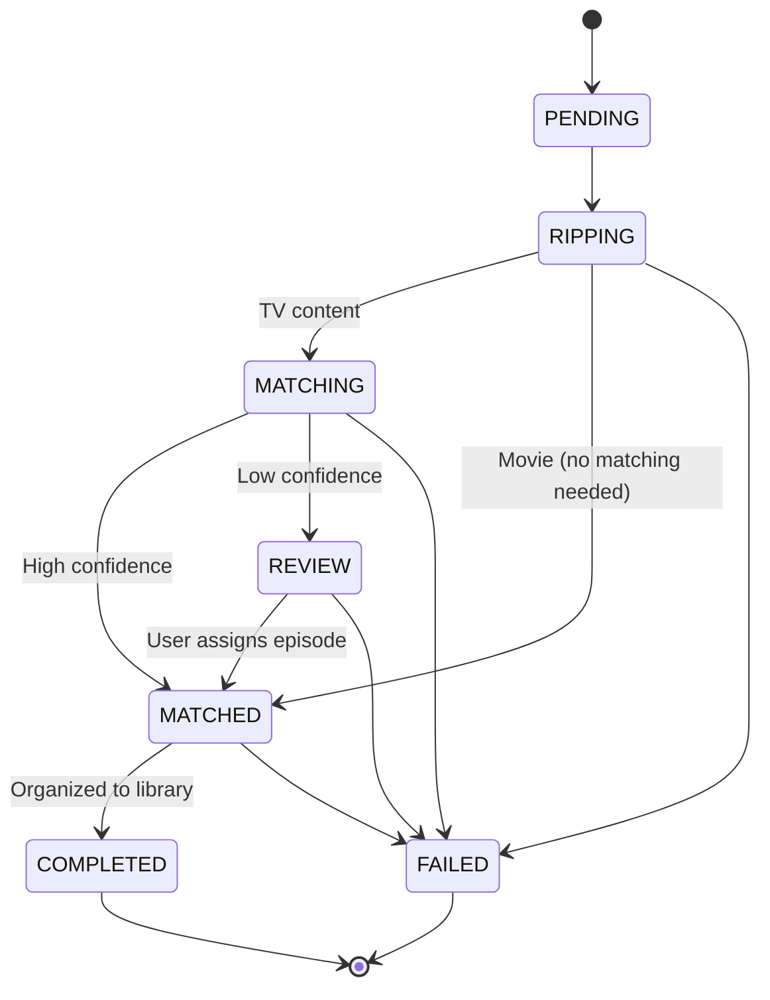

# State Machine

Engram uses explicit state machines to track both job-level and title-level processing. Every state transition is validated, persisted to SQLite, and broadcast to connected clients over WebSocket.

## Job States

A `DiscJob` moves through the following states during its lifecycle:

| State | Value | Description |
|-------|-------|-------------|
| **IDLE** | `idle` | Job created, waiting to start |
| **IDENTIFYING** | `identifying` | Scanning disc structure, classifying content type |
| **REVIEW_NEEDED** | `review_needed` | Human intervention required (low confidence, ambiguous content) |
| **RIPPING** | `ripping` | Active extraction via MakeMKV |
| **MATCHING** | `matching` | Audio fingerprinting to identify episodes |
| **ORGANIZING** | `organizing` | Moving files from staging to the media library |
| **COMPLETED** | `completed` | Terminal state -- all processing finished successfully |
| **FAILED** | `failed` | Terminal state -- processing failed with an error |

### Job State Diagram



### Valid Transitions

The `JobStateMachine` enforces these transitions. Any attempt to perform an invalid transition is rejected and logged as a warning.

| From State | Valid Next States |
|------------|-------------------|
| `IDLE` | `IDENTIFYING`, `FAILED` |
| `IDENTIFYING` | `RIPPING`, `REVIEW_NEEDED`, `FAILED` |
| `REVIEW_NEEDED` | `RIPPING`, `COMPLETED`, `FAILED` |
| `RIPPING` | `MATCHING`, `ORGANIZING`, `REVIEW_NEEDED`, `COMPLETED`, `FAILED` |
| `MATCHING` | `ORGANIZING`, `REVIEW_NEEDED`, `COMPLETED`, `FAILED` |
| `ORGANIZING` | `REVIEW_NEEDED`, `COMPLETED`, `FAILED` |
| `COMPLETED` | *(none -- terminal state)* |
| `FAILED` | *(none -- terminal state)* |

!!! note "Same-state transitions"
    A job is allowed to "transition" to its current state (a no-op update). This is useful for progress updates that refresh the `updated_at` timestamp without changing the state.

### REVIEW_NEEDED Branching

The `REVIEW_NEEDED` state is reachable from multiple stages, each for a different reason:

- **From IDENTIFYING**: Classification confidence is too low. The Analyst or TMDB Classifier could not determine whether the disc is TV or movie with sufficient certainty.
- **From RIPPING**: Ambiguous results during extraction (e.g., unusual title structure).
- **From MATCHING**: Audio fingerprint matching produced low-confidence results or competing candidates for the same episode slot.
- **From ORGANIZING**: A file conflict requires user resolution (when `conflict_resolution_default` is set to `"ask"`).

When a job enters `REVIEW_NEEDED`, it appears in the Review Queue on the frontend. After the user resolves the issue, the job transitions to `RIPPING` (to continue processing) or `COMPLETED` (if the user chooses to skip).

### FAILED Branching

The `FAILED` state is reachable from every non-terminal state. Common failure causes:

- MakeMKV subprocess errors during scanning or ripping
- Database commit failures
- External API errors (TMDB, TheDiscDB) when no fallback is available
- File system errors during organization

When a job fails, the `error_message` field is populated with the reason, and `completed_at` is set to the current timestamp.

---

## Title States

Individual titles (tracks) on a disc have their own state machine tracked by `TitleState`:

| State | Value | Description |
|-------|-------|-------------|
| **PENDING** | `pending` | Title discovered, waiting to be processed |
| **RIPPING** | `ripping` | Currently being extracted by MakeMKV |
| **MATCHING** | `matching` | Audio fingerprinting in progress |
| **MATCHED** | `matched` | Successfully matched to an episode but not yet organized |
| **REVIEW** | `review` | Ripped successfully but needs human review for episode assignment |
| **COMPLETED** | `completed` | Organized into the media library |
| **FAILED** | `failed` | Processing failed for this title |

### Title State Diagram



---

## Terminal State Callbacks

The `JobStateMachine` supports registering callbacks that fire when a job reaches a terminal state (`COMPLETED` or `FAILED`). These are used for cleanup operations.

```python
state_machine.on_terminal_state(callback)
# Callback signature: async def callback(job_id: int, state: JobState) -> None
```

**Current uses:**

- **Staging cleanup**: When a job completes or fails, its staging directory is cleaned up according to the configured policy (immediate delete, move to trash, or retain for a configurable period).
- **completed_at timestamp**: Automatically set in the `transition()` method when entering `COMPLETED` or `FAILED`.

---

## State Transition Validation

The `JobStateMachine.transition()` method performs the following steps for every state change:

1. **Validate** -- Check the transition against the `VALID_TRANSITIONS` map. If invalid, log a warning and return `False`.
2. **Update** -- Set the new state and `updated_at` timestamp on the job. If transitioning to `FAILED`, set `error_message`. If transitioning to a terminal state, set `completed_at`.
3. **Persist** -- Commit the change to the database via the async session.
4. **Broadcast** -- Send the appropriate WebSocket message to all connected clients. Broadcasting failures are non-fatal since the database is already committed.
5. **Callbacks** -- Fire any registered terminal-state callbacks for `COMPLETED` or `FAILED` transitions.

### Convenience Methods

The state machine provides convenience methods for common transitions:

| Method | Target State | Extra Behavior |
|--------|-------------|----------------|
| `transition_to_failed()` | `FAILED` | Requires `error_message` parameter |
| `transition_to_review()` | `REVIEW_NEEDED` | Optionally sets `review_reason` on the job |
| `transition_to_completed()` | `COMPLETED` | Sets `completed_at` automatically |

### Introspection

```python
# Check if a transition is allowed
can_proceed = state_machine.can_transition(JobState.RIPPING, JobState.MATCHING)

# Get all valid next states from current state
next_states = state_machine.get_next_states(JobState.IDENTIFYING)
# Returns: {JobState.RIPPING, JobState.REVIEW_NEEDED, JobState.FAILED}
```
