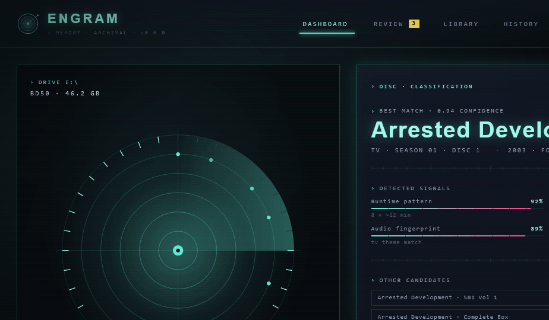
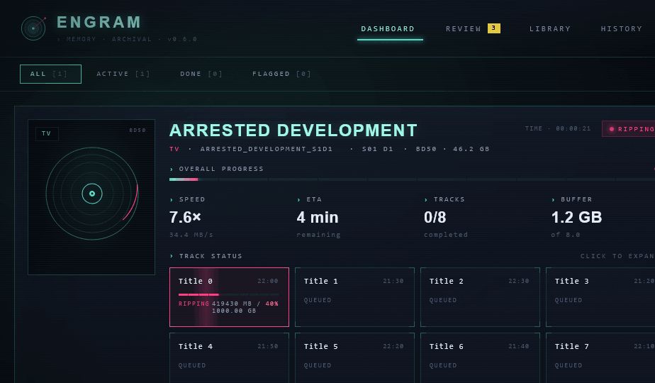
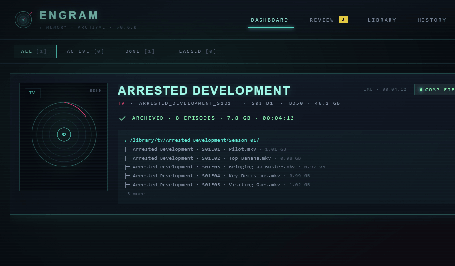
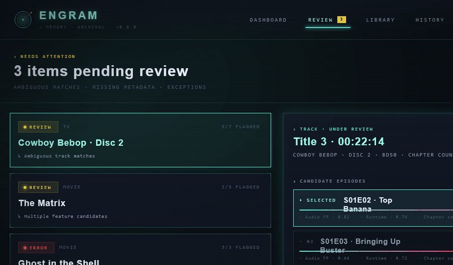
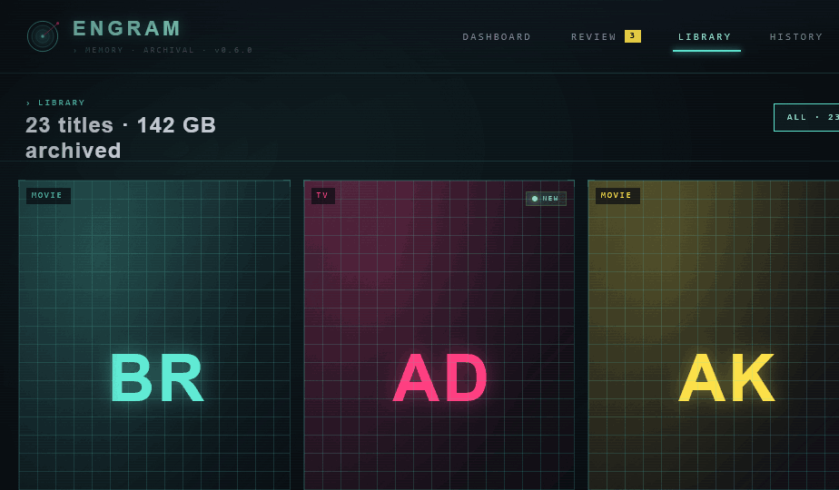
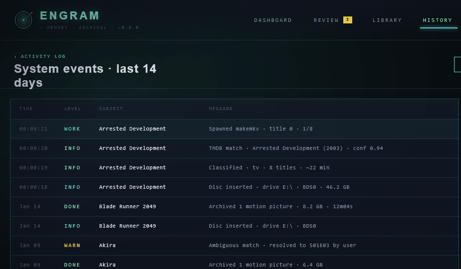
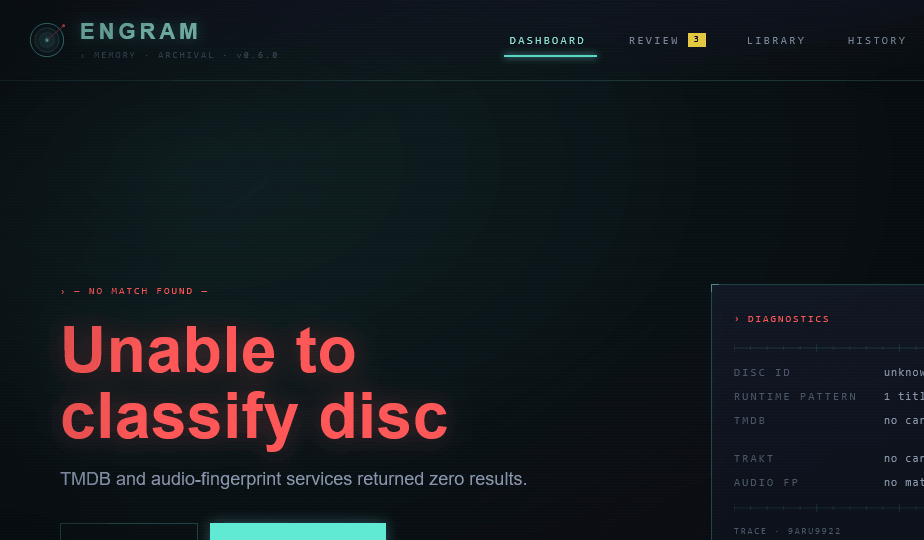

# Handoff: Engram — Synapse UI Refresh

## Overview

Full UI refresh for **Engram**, a disc ripping & media organization tool that automates the workflow from disc insertion → ripping → metadata matching → archive. This handoff covers the **Synapse v2** direction: a Neo-Tokyo / Blade Runner cyberpunk aesthetic — deep blue-black canvas, cyan + magenta accents, Chakra Petch + JetBrains Mono, with light atmospheric chrome (scanlines, distant skyline, scrolling telemetry).

The design is medium-density (the production target). Min/dense variants and color-balance toggles exist in the prototype but are exploratory; ship `density: 'med'` and `colorBalance: 'balanced'` (cyan-primary, magenta-secondary) as defaults.

## About the Design Files

The files in this bundle are **design references created in HTML** — interactive prototypes showing the intended look and behavior. They are not production code to copy directly. The task is to **recreate these designs in Engram's existing frontend codebase** (React + TypeScript + Vite, see `frontend/`) using the existing patterns, component library, and state stores. Lift exact tokens, typography, spacing, and interaction details from the prototype, but implement them as proper TypeScript React components in `frontend/src`.

## Screen previews

Reference renders of each artboard at 1280×820 (medium density, balanced color, scanlines + skyline on):

### 1. Disc insert / classification


### 2. Dashboard — ripping


### 2b. Dashboard — complete


### 3. Review queue


### 4. Library


### 5. History


### 6. Error — no match


> Each PNG is the screen rendered standalone at the production target size; open the HTML prototype for hover, animation, and the disc-phase / state transitions.

---

## Fidelity

**High-fidelity.** Colors, typography, spacing, and most interactions are final. The bar/grid charts, scanline overlay, skyline silhouette, and animated radar sweep are intentional and should be reproduced. Recreate pixel-accurately.

## Files in this bundle

- `Engram Synapse v2.html` — entry point. Loads React via CDN + Babel and mounts the canvas.
- `design-canvas.jsx` — (presentation only) Pan/zoom canvas hosting all 6 artboards. Not part of the production UI.
- `tweaks-panel.jsx` — (presentation only) the in-prototype Tweaks panel. Not part of the production UI.
- `shared.jsx` — small dataset shared with sibling directions (titles, tracks, sample state). Useful as a fixture reference.
- `synapse-v2/data.jsx` — extended sample data for Library, Review queue, History, candidate matching.
- `synapse-v2/core.jsx` — **design tokens, primitives, and atmosphere**. Read this first.
- `synapse-v2/shell.jsx` — top bar (logo, nav, status pill) + bottom status bar.
- `synapse-v2/dashboard.jsx` — main dashboard (job header, drive panel, track grid, byte progress, log feed).
- `synapse-v2/screens.jsx` — disc-insert/classification, review queue, library, history, error states.
- `synapse-v2/app-v2.jsx` — composes the artboards + tweaks panel; not needed in production.

To run the prototype locally: open `Engram Synapse v2.html` in any modern browser.

## Design tokens (from `synapse-v2/core.jsx`, the `sv` object)

### Color

| Token | Hex | Use |
|---|---|---|
| `bg0` | `#05070c` | Page bg, deepest layer |
| `bg1` | `#0a0e18` | Card bg layer 1 |
| `bg2` | `#121827` | Card bg layer 2 (panels) |
| `bg3` | `#1a2234` | Bg layer 3 (hover, active row) |
| `ink` | `#e6ecf5` | Primary text |
| `inkDim` | `#8893a8` | Secondary text, labels |
| `inkFaint` | `#4a5369` | Tertiary text, ticks |
| `inkGhost` | `#2a3147` | Disabled, separators on dark |
| `cyan` | `#5eead4` | **Primary accent** (active, success, primary action) |
| `cyanHi` | `#9ff8e8` | Hover/glow on cyan |
| `cyanDim` | `#2dd4bf` | Cyan at lower emphasis |
| `magenta` | `#ff3d7f` | **Secondary accent** (ripping, in-progress, magenta-forward color balance) |
| `magentaHi` | `#ff7aa5` | Hover on magenta |
| `magentaDim` | `#d63171` | |
| `yellow` | `#fde047` | Notification badges, scanning state |
| `amber` | `#fcd34d` | Matching state |
| `green` | `#86efac` | Complete / live status |
| `greenDim` | `#4ade80` | |
| `red` | `#ff5555` | Errors |
| `purple` | `#a78bfa` | Reserved (unused currently) |

### Lines / borders (cyan at varying alpha — gives the screen its tint)
- `line` — `rgba(94,234,212,0.14)` — default 1px borders
- `lineMid` — `rgba(94,234,212,0.24)` — section dividers
- `lineHi` — `rgba(94,234,212,0.42)` — corner ticks, focused state

### Typography

| Token | Stack |
|---|---|
| `mono` | `"JetBrains Mono", ui-monospace, monospace` |
| `sans` | `"Chakra Petch", "Space Grotesk", sans-serif` |
| `display` | `"Chakra Petch", sans-serif` |

Load from Google Fonts:
```
JetBrains+Mono:wght@300;400;500;600;700
Chakra+Petch:wght@400;500;600;700
Space+Grotesk:wght@400;500;600;700
```

### Type scale (medium density)
| Use | Family | Size | Weight | Letter-spacing | Notes |
|---|---|---|---|---|---|
| Big numeric (progress %) | display | 56–96px | 700 | 0.04em | Use cyan with `text-shadow: 0 0 24px <cyan>55` |
| Section title | display | 24–30px | 700 | 0.04em | |
| Card title | display | 18–22px | 600 | 0.04em | |
| Body | sans | 14–16px | 400 | normal | |
| Mono numbers (sizes, IDs) | mono | 11–14px | 400–500 | 0.06–0.10em | |
| Label (›  UPPERCASE) | mono | 10–11px | 400 | 0.20em | Always uppercase, prefixed with `›` caret |
| Tiny tag | mono | 9–10px | 400 | 0.22em | |

### Spacing (medium density, from `useDensity()`)
- `pad: 22` (outer page padding)
- `gap: 14` (default flex gap)
- `cardPad: 14`
- `rowHeight: 40`
- `headerPad: 18`
- Top bar padding: `18px 28px`
- Status bar padding: `8px 20px`
- Section divider gap: `28px`

### Borders, corners, glow
- 1px solid borders, color from line tokens (mostly `lineMid` for panels)
- **Corner ticks** are signature — every panel gets 8px L-shaped tick marks at all 4 corners (`SvCorners`). Implement as 4 absolutely-positioned divs with 1.5px borders.
- Cards do **not** use border-radius. Sharp 90° corners throughout.
- Glow: `box-shadow: 0 0 24px <accent>22, inset 0 0 32px rgba(94,234,212,0.03)` for emphasized panels
- Active/primary buttons: `box-shadow: 0 0 14px <accent>55`

### Atmosphere overlays
- **Ambient haze** — two large radial gradients in the bg layer (cyan top-left, magenta bottom-right at ~7-10% alpha)
- **Scanlines** — `repeating-linear-gradient(0deg, rgba(94,234,212,0.05) 0 1px, transparent 1px 3px)` at `opacity: 0.35`. User-toggleable in Settings.
- **SVG grain** — `feTurbulence baseFrequency="0.85"` at `opacity: 0.08, mix-blend-mode: overlay`
- **Vignette** — radial gradient transparent → `rgba(0,0,0,0.5)` at corners
- **Distant skyline** — bottom 180px SVG silhouette with cyan/magenta window-light flickers. Toggleable.

## Screens

There are 6 screens. Routes are `dashboard`, `review`, `library`, `history`. Disc-insert is a state of `dashboard`. Errors are full-screen takeovers within `dashboard`.

### Shell — Top bar + Status bar (`shell.jsx`)

**Top bar** (always present): 76px tall, bottom-bordered with `sv.line`.
- Left: 38px logo mark (`SvMark` — concentric rings + axon), wordmark "ENGRAM" 22px Chakra Petch 700, `letter-spacing: 0.18em`, color `cyanHi`, `text-shadow: 0 0 12px <cyan>55`. Subline: `› MEMORY · ARCHIVAL · v0.6.0` 9px mono, 0.24em, `inkFaint`.
- Center: nav (`DASHBOARD | REVIEW [3] | LIBRARY | HISTORY`). Active item gets a 2px underline at `cyan` with glow. Yellow badge for unread Review count.
- Right: green `LIVE` pill (animated dot), settings cog button.

**Status bar** (always present): 36px tall, top-bordered.
- Left: `● 1 ACTIVE`, `● 0 ARCHIVED`, `DRIVE E: READY`
- Center: scrolling telemetry strip (`SvTelemetryBand`) — horizontal infinite scroll of strings like `UNIT 07`, `WS·CONNECTED`, `BUFFER 1.2/8.0 GB`, `THERMAL NOMINAL`. Use a CSS `@keyframes svScroll` translating from 0 to -50% over ~100s, with a side mask gradient for fade-in/out.
- Right: `WS · CONNECTED`, version pill.

### 1. Disc insert / classification (`SvDiscInsert`, `screens.jsx`)

Two-column grid (1fr 1.2fr).

**Left — animated disc panel.** Bordered panel with corner ticks. Centered SVG (400×400):
- 6 concentric rings at radii 30/60/90/120/150/180, cyan at 0.2–0.6 opacity
- Crosshair lines (vertical+horizontal) at 0.3 opacity
- During `scan`/`classify`: rotating sweep wedge — `<path d="M 200 200 L 380 200 A 180 180 0 0 0 200 20 Z" fill="url(#sweep)">` inside a `<g style="transform-origin: 200px 200px; animation: svSpin 3s linear infinite">`
- Center hub: 8px filled cyan circle + 3px bg cutout
- 36 chapter ticks on the outer ring, lit cyan as the phase progresses
- During `classify`/`ready`: 8 pulsing dots at the 150-radius mark for detected titles
- Top-left overlay: drive label + capacity (`Drive E:\` / `BD50 · 46.2 GB`)
- Bottom: 4-step phase breadcrumb (DETECT/SCAN/CLASSIFY/READY) with top-border highlight

**Right — classification panel.**
- Header: `› Disc · classification` label + `ANALYZING` scanning badge
- Best match block: yellow label "Best match · 0.94 confidence", title in 38px display 700 cyan with `text-shadow: 0 0 18px <cyan>55`, then mono meta line `TV · SEASON 01 · DISC 1 · 2003 · FOX · TMDB #4589`
- "Detected signals" 2-col grid: Runtime pattern, Volume label, Audio fingerprint, Chapter markers — each shows label/confidence percent + 2px bar + value text
- "Other candidates" list — 3 alternative matches with confidence percent
- Footer actions: `EJECT` (ghost), `EDIT · MANUAL` (ghost), `CONFIRM · BEGIN RIP` (cyan filled, primary)

### 2. Dashboard (`SvDashboard`, `dashboard.jsx`)

Three states: `ripping`, `matching`, `complete`. All share the same chrome; the body region swaps.

**Job header strip** (top of body):
- Left: badge for current state, then job title in 30px display 700, then mono meta row (BD50 · 46.2 GB · DRIVE E:\)
- Right: live elapsed timer (mono 14px), runtime estimate

**Body grid** (medium density: 1.4fr 1fr):

Left — **track grid** (`SvTrackGrid`):
- 8 cards in a 4-col grid (or 3 on min, 6 on dense)
- Each card: corner ticks, type badge (FEATURE/EPISODE/EXTRA), title + chapter count, runtime, byte progress bar (per-track), state badge
- Hover: lift 2px, border to cyan, glow shadow `0 8px 24px <cyan>33`
- Active track (currently ripping): magenta border, magenta `RIPPING` badge with pulsing dot, animated bar with sweep highlight

Right — **side rail** (vertical stack):
- Big numeric: aggregate progress percent in 64px+ display, cyan with glow
- Byte progress: filled bar, MB ripped / total, MB/s readout
- Mini chart: throughput sparkline (last 60s), `SvBarChart`
- Activity log: last 6 events streamed in (`SV_HISTORY` style), terminal-styled with timestamp/tag/message

### 3. Review queue (`SvReviewQueue`, `screens.jsx`)

Header strip with yellow `Needs attention` label, big number + headline, filter/sort pills.

Two-column body (1.1fr 1.4fr):
- **Left — queue list**: stacked cards from `SV_REVIEW_QUEUE`. Each card: state badge (REVIEW/ERROR), type, flagged ratio, title, "↳ {need}" subline. Active card has cyan border + glow.
- **Right — detail / candidate picker**: track header (Title 3 · 00:22:14 · CHAPTER COUNT 8) + warn badge. Then `Candidate episodes` list — clickable rows from `SV_CANDIDATES`, each showing match score, score bar, source breakdown (`Audio FP · 0.82`, `Runtime · 0.74`, `Chapter count · 0.78`). Selected row gets `▸ SELECTED` marker + cyan border. Footer: `SKIP · LATER` / `MARK UNMATCHED` / `CONFIRM MATCH` (cyan primary).

### 4. Library (`SvLibrary`, `screens.jsx`)

Header strip with `Library` label, "23 titles · 142 GB archived", filter pills (ALL · 23 / MOVIES · 15 / TV · 8 / UHD · 4).

Body:
- **Poster grid** — 4 cols (med) / 6 cols (dense). Each card has 2:3 aspect-ratio poster panel with big colored letters (BR / AD / AK etc.), grid overlay, type pill, NEW badge for `added: 'just now'`. Below: title, subtitle, year, size in mono. Hover lifts and glows.
- **Add card** — dashed border, big `+` button, `Insert disc to add` label
- Below grid: **recent archives table** — 5-col grid (date / title / year / quality / size) with bottom-border rows, all mono.

### 5. History (`SvHistory`, `screens.jsx`)

Header strip with `Activity log` label + filter pills (ALL/INFO/WARN/ERROR/DONE).

Body grid (1fr 320px):
- **Left — log stream**: panel with 4-col header (TIME/LEVEL/SUBJECT/MESSAGE) + rows from `SV_HISTORY`. Most-recent row tinted cyan. Time mono, level color-coded (green/yellow/cyan/red), subject in ink, message in inkDim — all monospaced.
- **Right — stats rail**: stacked panels.
  - Last 14 days: 2x2 stat grid (Archived/Volume/Matched/Flagged)
  - Throughput: 14-day bar chart (`SvBarChart`)
  - Distribution: Movies (15) cyan bar, TV seasons (8) magenta bar

### 6. Error / empty states (`SvErrorState`, `screens.jsx`)

Three variants: `no-match`, `no-drive`, `empty-library`.

Two-column 1.2fr/1fr at 60px padding, vertically centered.

**Left — message:**
- Tag label `— NO MATCH FOUND —` (red for errors, cyan for empty)
- Massive headline 64px display 700, color matches the tag, `text-shadow: 0 0 24px <c>44`, `text-wrap: balance`, max ~520px wide
- Subtitle 18px sans, inkDim
- Two action buttons (ghost + primary)

**Right — diagnostics panel:** corner-ticked, shows label + tag badge, ruler, key/value details grid (mono 11px), trace ID footer.

## Components

### Atomic (in `core.jsx`)

- `<SvAtmosphere>` — wraps a screen with the layered haze + scanlines + grain + vignette + skyline
- `<SvPanel>` — bordered panel with corner ticks, optional glow
- `<SvCorners>` — 4 corner tick marks
- `<SvLabel>` — uppercase mono caret label (`›  TEXT`)
- `<SvBar value={0..1}>` — gradient progress bar with chunked tick overlay
- `<SvBadge state="ripping|matching|complete|queued|error|live|scanning|warn">` — pill with colored dot
- `<SvRuler ticks={40}>` — horizontal ruler with major/minor ticks
- `<SvTelemetryBand items speed>` — scrolling marquee of mono strings
- `<SvScramble text>` — text mount-in scramble effect
- `<SvMark>` — logo (concentric rings + axon)
- `<SvAnimValue target>` — slowly-creeping animated percent value

### Density / context
A small React context (`SvCtx`) carries `density`, `colorBalance`, `scanlines`, `skyline`. `useDensity()` returns sizing tokens; `useAccent()` returns `{primary, primaryHi, secondary, secondaryHi}` based on balance. **For production: hard-wire to `med` density and `balanced` color balance** — those are the targets. Scanlines + skyline can be user prefs in Settings.

## Interactions & behavior

- **Live updates** — dashboard subscribes to a websocket (`WS · CONNECTED` is real). Aggregate progress, byte progress, MB/s, active track, and log feed all update in real time. Use `requestAnimationFrame` only for animation; data updates can be at 1–4Hz.
- **Track card hover** — `transform: translateY(-2px)`, border to cyan, glow on. Use `transition: all 0.18s`.
- **Disc-insert phases** — 4 phases auto-advance: detect (instant) → scan (3–8s, sweep visible) → classify (1–2s, dots appear) → ready (waits for user confirmation). Cancel/eject available at any point.
- **Match candidate selection** — clicking a candidate row highlights it; CONFIRM MATCH commits via API. Keyboard: ↑/↓ to move, Enter to confirm.
- **Telemetry band** — pure CSS animation, no JS.
- **Animated radar sweep** — pure CSS rotation on the SVG `<g>`. Don't try to drive it from React state.

## State management

Add to existing Zustand stores in `frontend/src/lib/`:
- `useRipStore` — adds `aggregate progress`, `bytesRipped`, `bytesTotal`, `mbPerSec`, `activeTrackId`, `tracks[]`, `elapsed`, `eta`, `state`
- `useDiscStore` — adds `phase: 'detect'|'scan'|'classify'|'ready'`, `bestMatch`, `candidates`, `signals[]`
- `useReviewStore` — adds `queue[]`, `selectedItemId`, `candidates[]`, `selectedCandidateIdx`
- `useLibraryStore` — adds `items[]`, `filter`, `recentArchives[]`
- `useHistoryStore` — adds `events[]`, `filter`
- `useUiStore` — adds `scanlines: bool`, `skyline: bool` (user prefs, persist to localStorage)

## Implementation notes

- **No rounded corners** anywhere. Sharp 90° throughout.
- **Corners ticks** are the recurring motif — apply liberally to any bordered container.
- All caps labels use `letter-spacing: 0.20em` minimum.
- Mono numerics use tabular figures; add `font-variant-numeric: tabular-nums` so progress percentages don't jitter.
- Border alpha is intentional — avoid solid `#fff1` style; use the cyan-tinted line tokens so the whole screen reads as a unified palette.
- Don't draw the skyline silhouette as PNG/JPG — keep it SVG so it scales and the window-light flickers stay crisp.
- Animations use `cubic-bezier` only when feel matters; default to `ease`/`linear`. The pulse is `1.2s infinite`, sweep is `3s linear infinite`, scroll is `~100s linear infinite`.

## Assets
None — all visuals are SVG/CSS. Logo mark is in `core.jsx` as `<SvMark>`. No imagery needed; placeholder posters are colored letters.

## Out of scope (not in this handoff)
- The 5 sibling directions (Synapse 2049, Nostromo, Wetware, Terminal, Prism) — see the main `Engram Refresh.html` if interested
- Settings/wizard screen (covered by sibling Synapse direction; if reusing those, the chrome maps 1:1 — same panels, same tokens)
- Light mode (out of scope; this aesthetic is dark-only by design)
