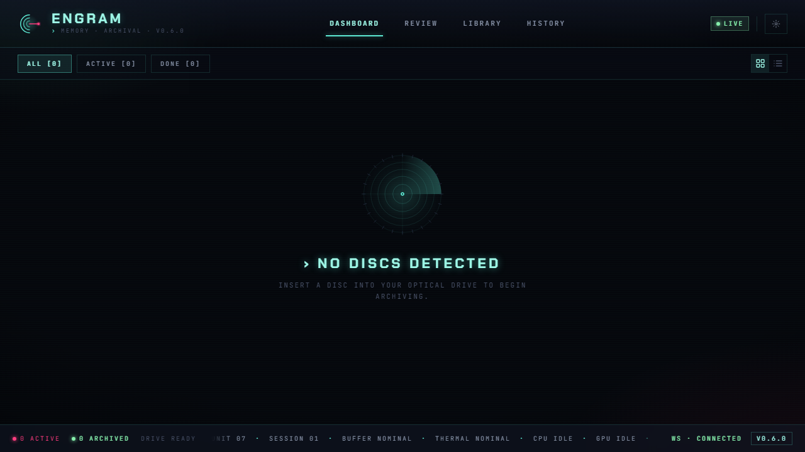
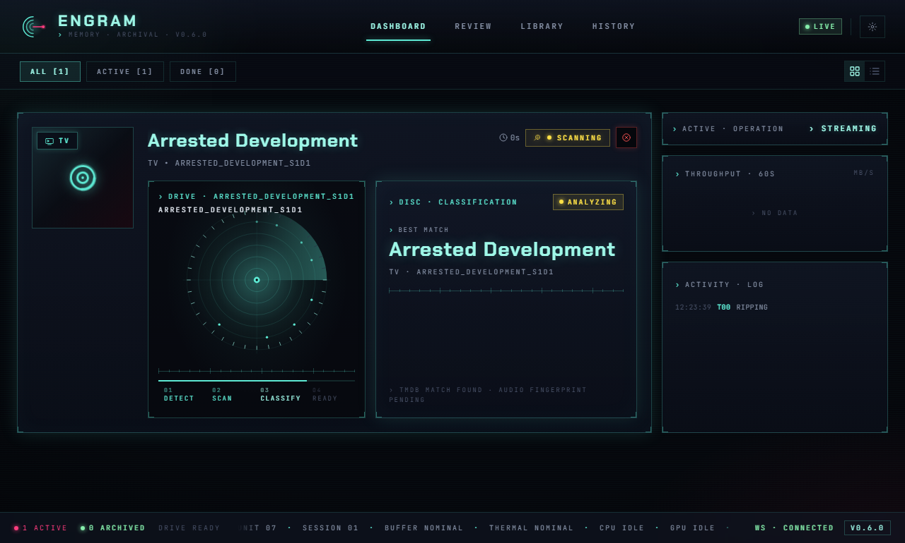
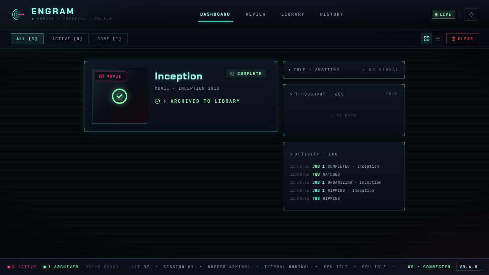

# Dashboard

The Engram dashboard is the main interface for monitoring disc ripping jobs in real time. It displays a filterable list of job cards that update live via WebSocket, giving you full visibility into every stage of the archival pipeline.

## Overview

When you open Engram, the dashboard shows all current disc jobs as cards. Each card represents one disc and tracks its progress from insertion through to library organization.

When no jobs are active, the dashboard displays a pulsing Engram logo with context-sensitive messaging depending on the active filter.

## Job Cards

When a disc is inserted (or a simulated disc is created), a new **DiscCard** appears on the dashboard with animated entry.

Each card includes:

- **Poster art** -- fetched automatically from TMDB when available, displayed with a holographic sweep effect. Falls back to a disc icon when no poster is found.
- **Content type badge** -- overlaid on the poster corner. Color-coded: cyan for TV, magenta for Movie.
- **Title and metadata** -- the detected title (or volume label if detection has not resolved yet), subtitle, and original disc label.
- **State indicator** -- a color-coded badge showing the current pipeline stage (Scanning, Ripping, Matching, Organizing, Completed, Error).
- **Elapsed timer** -- running clock showing how long the active operation has been going.
- **Subtitle warning** -- a warning icon appears if subtitle downloads failed.
- **Failed track count** -- if any tracks failed during ripping, the count is shown in red.

### Ripping Progress

During the ripping stage, the card expands to show detailed progress information.

The ripping view includes:

- **Overall progress bar** -- a cyberpunk-styled progress bar with percentage and animated gradient.
- **Speed** -- the current ripping speed reported by MakeMKV (e.g., `12.3 MB/s`).
- **ETA** -- estimated time remaining, formatted as minutes or hours.
- **Track counter** -- shows completed tracks out of total (e.g., `3/8`).

### Per-Track Progress

Below the summary stats, a **TrackGrid** shows every title on the disc with individual progress.

Each track tile displays:

- Track title and duration
- Individual progress bar (during ripping)
- State badge (Pending, Ripping, Matching, Matched, Failed, Completed)
- Match candidates with confidence scores (during and after matching)
- Final match result and episode code
- File size and chapter count
- Output filename and organized destination path

### Matching State

When the job transitions to matching, the card shows:

- Animated "MATCHING EPISODES..." indicator
- Subtitle download status (if subtitles are still downloading)
- Matched / In Progress / Pending counters
- The TrackGrid with match candidates appearing as they resolve

### Completed State

Once all tracks are matched and organized into the library, the card shows a green checkmark overlay on the poster and an "ARCHIVED TO LIBRARY" confirmation.

Movie cards follow the same lifecycle but with magenta-themed accents:

## Filters

The secondary toolbar below the header provides three filter buttons:

| Filter | Shows | Badge |
|--------|-------|-------|
| **ALL** | Every job currently on the dashboard | Total count |
| **ACTIVE** | Jobs that are scanning, ripping, matching, or organizing | Active count |
| **DONE** | Jobs in completed or error state | Completed count |

Each button displays its count in brackets, e.g., `ACTIVE [2]`. The active filter is highlighted with a cyan accent.

## View Modes

Two view modes are available via the toggle in the toolbar:

- **Expanded** (grid icon) -- full-sized cards with poster art, progress bars, track grids, and all metadata. This is the default.
- **Compact** (list icon) -- a dense table-like view with one row per job. Each row shows a state dot, content type, title, progress bar, ETA, and action buttons. Useful when many jobs are running simultaneously.

In compact mode, each row provides:

- A color-coded state dot (green = completed, red = error, magenta = ripping, cyan = scanning, amber = matching)
- Content type label (TV, MOVIE, or `...` for unknown)
- Truncated title
- Inline progress bar with percentage
- ETA in minutes
- REVIEW button (if review is needed)
- CANCEL button (for active jobs)

## Real-Time Updates

The dashboard maintains a persistent WebSocket connection to the backend. A connection indicator in the header shows:

- **LIVE** (green, with lightning bolt icon) -- connected and receiving updates
- **OFFLINE** (gray, with disconnected icon) -- not connected; the dashboard will auto-reconnect with exponential backoff

All job state changes, ripping progress, track discoveries, match results, and subtitle progress are pushed from the server in real time. When the connection is re-established after a disconnect, the full job list is reloaded to ensure state consistency.

## Cancel and Clear

- **Cancel** -- available on any active job (not completed or errored). Appears as a red CANCEL button on hover (expanded view) or always visible (compact view). Cancels the in-progress operation and moves the job to a failed state.
- **Clear Completed** -- when completed jobs exist, a red CLEAR button appears in the toolbar. Clicking it soft-deletes all completed/failed jobs from the dashboard (they remain accessible in [Job History](history.md)).

## Navigation

The header provides navigation tabs for **Dashboard** and **History**. A gear icon opens the [Config Wizard](../index.md) for managing settings. The footer bar shows live counts of active and archived jobs along with the current version number.
